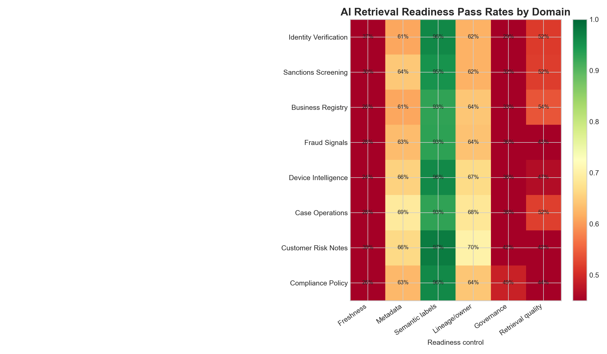
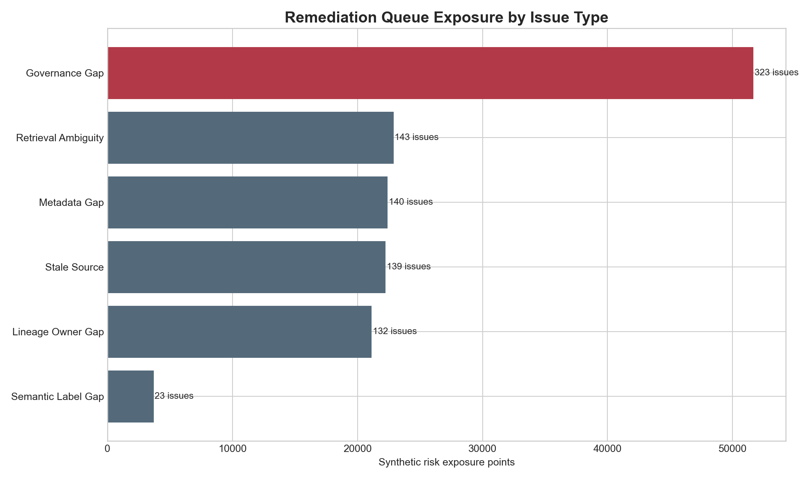
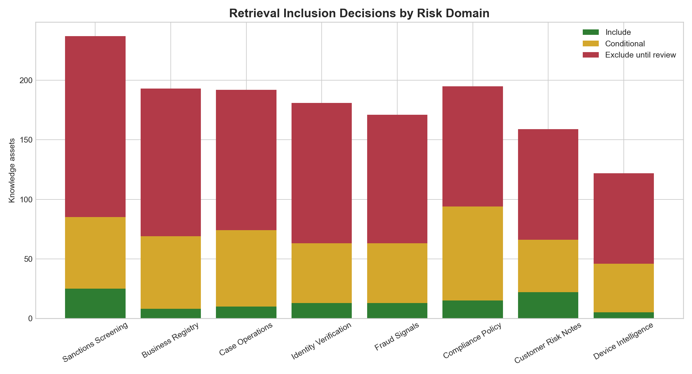
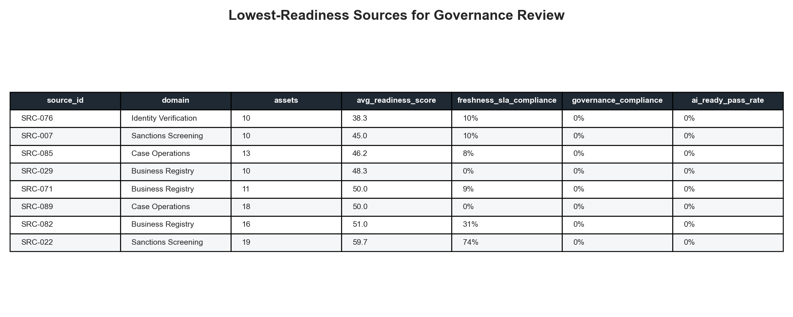

# AI Retrieval Readiness Governance Lab

## Motivation

Risk-assessment AI tools are only as reliable as the datasets, documents, and knowledge assets they retrieve from. If approved sources are stale, poorly described, ambiguously labeled, or governed inconsistently, a copilot or search-based assistant can return confident but weak context to analysts working identity, fraud, compliance, or case-review workflows.

This project treats AI retrieval readiness as an operating control problem: which sources can be included, which assets need remediation, and which governance gaps should block retrieval until reviewed.

## What This Project Is

This is a data-backed readiness lab for AI-consumed risk knowledge assets. It uses synthetic but realistic source-style data to model the work of preparing and maintaining AI-ready content across structured tables, documents, runbooks, policy material, and case-support knowledge.

The lab includes:

- Source inventories for approved AI data and knowledge feeds.
- Asset-level freshness, metadata, semantic labeling, lineage, classification, access, and retention checks.
- SQL checks that express repeatable readiness controls.
- Python analysis that generates readiness metrics, ranked remediation queues, and evidence images.
- Recommendations for inclusion, exclusion, and remediation sequencing.

## Why This Problem Matters

In risk-assessment workflows, retrieval mistakes do not just create messy answers. They can point analysts to stale policy, overexposed content, unlabeled decision signals, or knowledge assets with unclear ownership. The highest-value control is not a prettier dashboard; it is a repeatable evidence pack that tells product, governance, and platform teams what can be safely retrieved and what must be fixed first.

## Data Or Evidence Used

All data is synthetic and intentionally documented. It is shaped around risk, identity, fraud, compliance, and case-operations workflows without using or claiming access to proprietary RELX or LexisNexis Risk Solutions data.

The source data includes:

- `data/approved_ai_sources.csv`: 96 approved-source style records.
- `data/knowledge_assets.csv`: 1,450 AI-consumed asset records across tables, documents, policies, runbooks, FAQs, and case templates.
- `data/metadata_reviews.csv`: metadata completeness, ownership, lineage, and semantic label review status.
- `data/governance_policy_checks.csv`: classification, access-control, and retention checks.
- `data/lineage_edges.csv`: upstream/downstream lineage samples.
- `data/remediation_queue.csv`: ranked readiness issues and recommended owners.

## How The Project Works

The core readiness logic scores each knowledge asset against six controls:

- Freshness SLA compliance.
- Metadata and business-description completeness.
- Semantic labeling or categorization coverage.
- Ownership and lineage documentation.
- Classification, access-control, and retention compliance.
- Retrieval clarity and risk-decision signal actionability.

The Python pipeline in `scripts/generate_ai_readiness_lab.py` regenerates the synthetic data, computes the readiness metrics, writes summary outputs, and renders the evidence images in `docs/images/`.

The SQL file in `analysis/sql_checks.sql` translates the same controls into analyst-readable checks that could be adapted to a warehouse or governance QA layer.

## Outputs Or Views

### Readiness Control Heatmap



This heatmap shows pass rates by risk domain and readiness control. It makes governance and freshness gaps visible next to metadata, lineage, semantic labeling, and retrieval-quality controls.

### Remediation Exposure By Issue Type



This chart ranks remediation themes by synthetic exposure points. Governance gaps are highlighted because classification, access, and retention controls decide whether content is appropriate for AI retrieval.

### Retrieval Inclusion Decisions



This view separates assets into include, conditional include, and exclude-until-review decisions by domain. It supports the product/platform conversation about what should be in the retrieval corpus.

### Lowest-Readiness Sources



This rendered table lists the source groups that should be reviewed first based on readiness score, freshness, governance compliance, and AI-ready pass rate.

## What The Analysis Says

As of the synthetic July 22, 2026 snapshot:

- AI-ready pass rate is 7.7% across 1,450 knowledge assets.
- Freshness SLA compliance is 30.1%, making stale-source reduction a major readiness lever.
- Metadata and business-description completeness is 64.1%.
- Ownership and lineage documentation coverage is 65.2%.
- Governed access, classification, and retention compliance is 37.0%.
- Semantic labeling and categorization coverage is 95.0%.
- Risk-decision signal actionability is 91.6%.
- The remediation queue contains 767 non-resolved issues, including 323 P1 governance gaps.

The key point: semantic labels are mostly present, but AI retrieval should still be constrained because freshness, governance, ownership, and lineage controls lag the labeling layer.

## Recommendations

1. Block or conditionally exclude assets with P1 classification, access-control, or retention issues before adding them to retrieval scenarios.
2. Refresh high-criticality stale sources before tuning retrieval behavior; stale facts can create misleading confidence even when metadata is complete.
3. Require owner and lineage documentation for every approved source before treating retrieved context as decision-support evidence.
4. Convert missing or partial metadata into a weekly steward queue, with cycle-time targets tied to source criticality.
5. Measure post-remediation impact using AI-ready pass rate, freshness SLA compliance, metadata completeness, governance compliance, semantic label coverage, and issue cycle time.

## Repository Structure

```text
.
├── README.md
├── STATUS.md
├── data_dictionary.md
├── requirements.txt
├── analysis
│   ├── analysis_plan.md
│   ├── executive_findings.md
│   ├── sql_checks.sql
│   └── outputs
├── data
├── docs
│   └── images
└── scripts
    └── generate_ai_readiness_lab.py
```

## How To Run Or Inspect

Install dependencies:

```bash
python3 -m pip install -r requirements.txt
```

Regenerate the data, outputs, and images:

```bash
python3 scripts/generate_ai_readiness_lab.py
```

Inspect the main outputs:

```bash
ls data analysis/outputs docs/images
```

## Caveats And Limitations

This lab is synthetic and demonstrates analysis structure, readiness controls, and stakeholder decision logic. It does not use proprietary RELX or LexisNexis Risk Solutions data, does not claim production governance authority, and does not implement a live retrieval system. The data-generating process is intentionally transparent so assumptions can be challenged or adapted.
